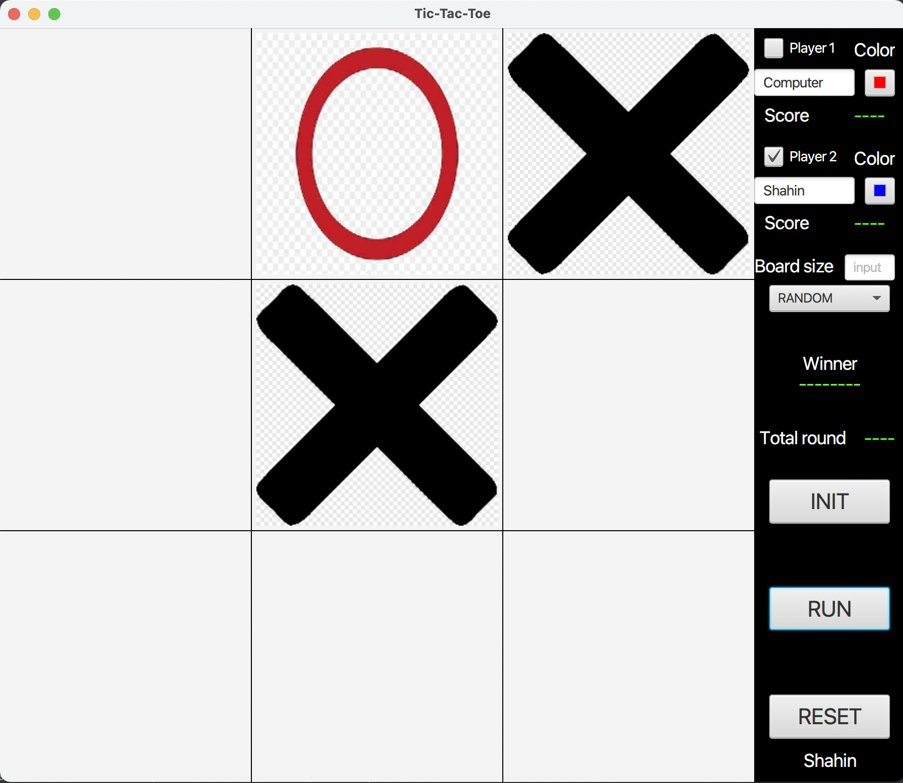

# project-of-javaFX

<h2 align="center">Tic Tac Toe Game</h2>
This project aims to create a game of Tic Tac Toe to illustrate the use of JavaFX.
<h3 align="center">Description</h3>
Tic Tac Toe is a game of reflection practiced by two players on a turn-by-turn basis and the aim of which is to be the first to create an alignment on a grid comprising a number n of rows and columns. Players take turns writing their symbol on the grid (usually a cross or a circle). The first to align n of their symbols horizontally, vertically or diagonally wins a point.\

## About The Project

